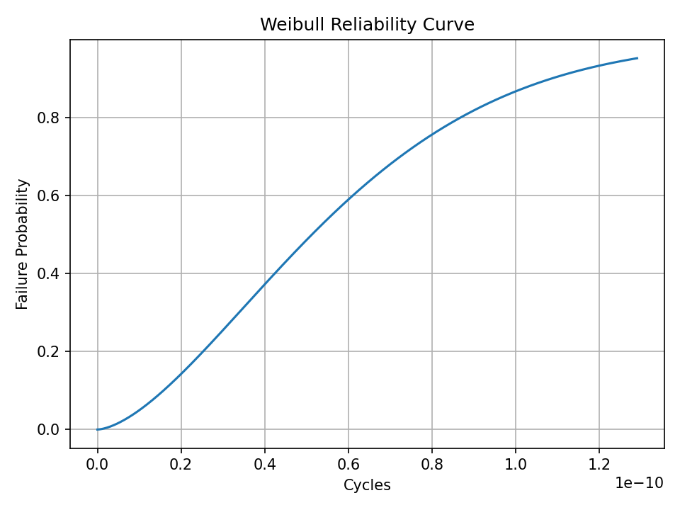
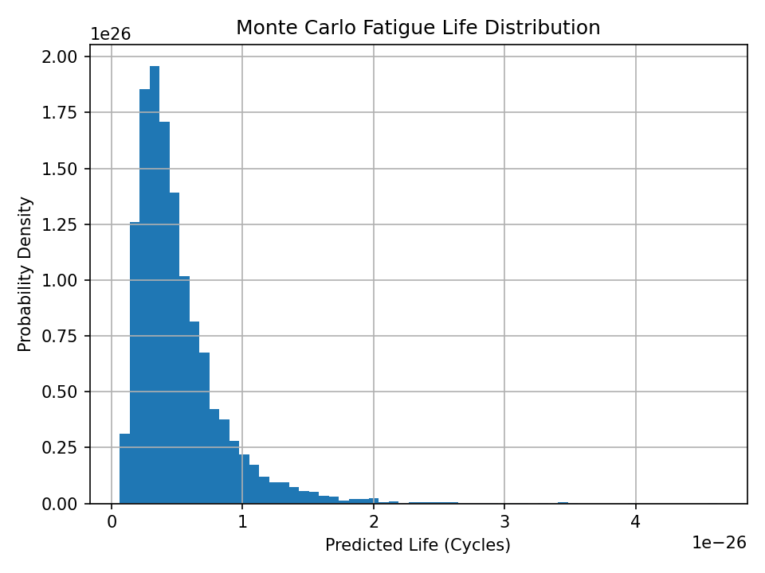

# Fatigue & Reliability Prediction Engine

A **production-grade fatigue and reliability analysis engine** built in
Python for predicting **mechanical life, cumulative damage, and
probabilistic failure behavior** under variable-amplitude loading. This
tool integrates **Goodman mean stress correction, Basquin S--N fatigue
life modeling, Miner's cumulative damage, Weibull reliability, and Monte
Carlo uncertainty simulation**.

------------------------------------------------------------------------

## 🚀 Features

-   Goodman mean stress correction\
-   Basquin S--N fatigue life prediction\
-   Variable-amplitude Miner cumulative damage\
-   Weibull failure probability & MTBF estimation\
-   Monte Carlo uncertainty simulation\
-   Automatic generation of engineering reliability plots

------------------------------------------------------------------------

## 🧠 Engineering Use Cases

-   Mechanical fatigue life prediction\
-   Reliability margin evaluation\
-   Variable-load damage accumulation\
-   MTBF and failure probability modeling\
-   Predictive maintenance planning

------------------------------------------------------------------------

## ⚙️ How It Works

The engine models fatigue life using:

-   **Alternating and mean stress decomposition**
-   **Goodman correction** for mean-stress effects\
-   **Basquin power-law S--N curve** for life prediction\
-   **Miner's Rule** for cumulative fatigue damage\
-   **Weibull statistical distribution** for probabilistic failure
    behavior\
-   **Monte Carlo simulation** to model material variability and
    uncertainty

The system outputs: - Total cumulative damage - Predicted life
distribution - Failure probability vs cycles - MTBF estimate

------------------------------------------------------------------------

## 📊 Outputs

### Weibull Reliability Curve


### Monte Carlo Fatigue Life Distribution



------------------------------------------------------------------------

## 🛠 Running the Project

### Install requirements:

``` bash
pip install numpy matplotlib
```

### Run the analysis:

``` bash
python fatigue_reliability_engine.py
```

The script will generate reliability plots automatically and save them
to disk.

------------------------------------------------------------------------

## 🔬 Technical Stack

-   Python 3\
-   Numerical Methods\
-   Mechanical Fatigue Modeling\
-   Weibull Statistics\
-   Monte Carlo Simulation\
-   Matplotlib

------------------------------------------------------------------------

